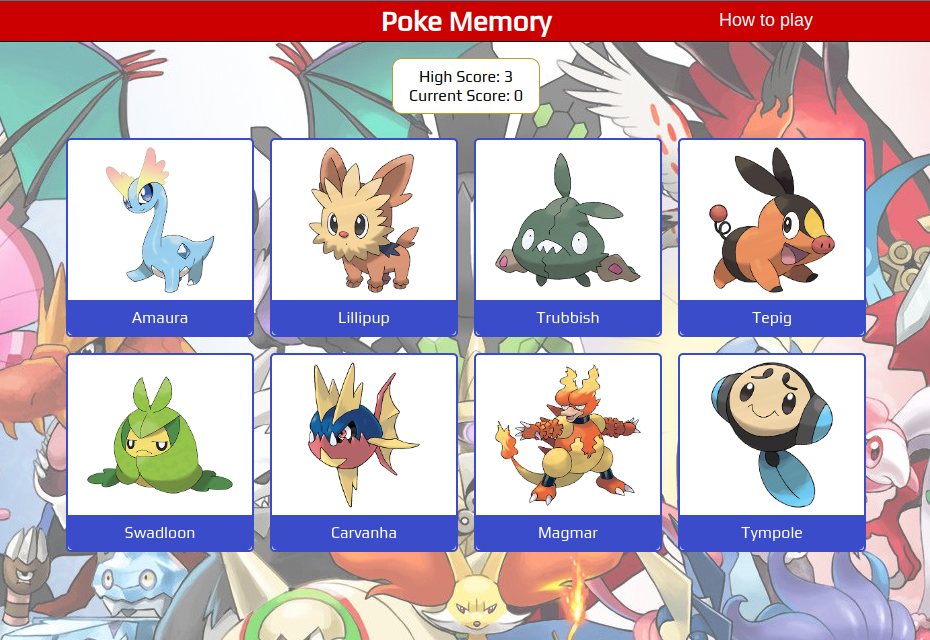

# Pokemon Memory Game

## Overview

A memory card game built on React using the [Poke API](https://pokeapi.co/) to fetch the card data. I built this project as part of my process of learning React.

Play the game: https://memory-game-seven-henna.vercel.app/

## How to play
- Click on the cards on the screen without repeating within a round.
- Once you click all the different Pokemon, a new round with more cards will start.
- You keep your score through rounds until you repeat a Pokemon within a round.
- Pokemon can repeat between rounds, an clicking on a Pokemon you had clicked on a previous round won't make you lose.
- The objective is to go as many rounds as you can and catch as many Pokemon you can by clicking on them.

## Features
- Get Pokemon cards at random from a collection of 1008 different Pokemon through the Poke API.
- The game is immersive with animations that respond to user interactions and the game flow.
- Save your High Score in your browser's Local Storage to make it persist through game sessions.
- Mobile responsiveness lets you play the game on your phone as well as your computer.
- The use of React makes the User Interface efficiently reactive.